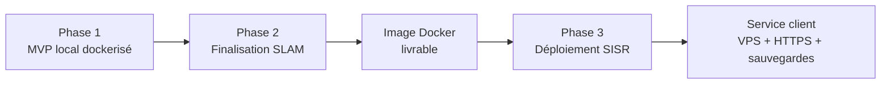
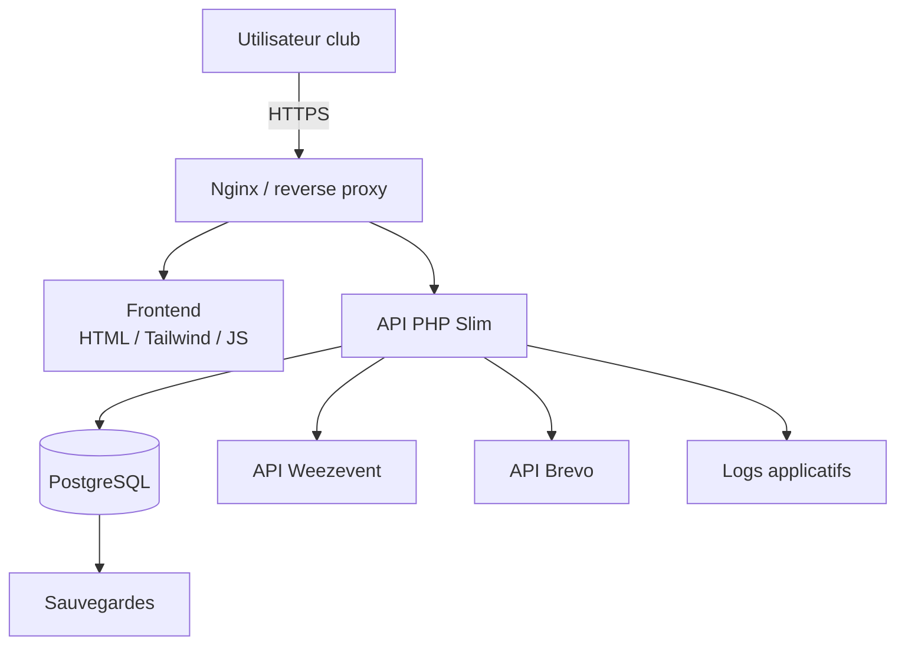
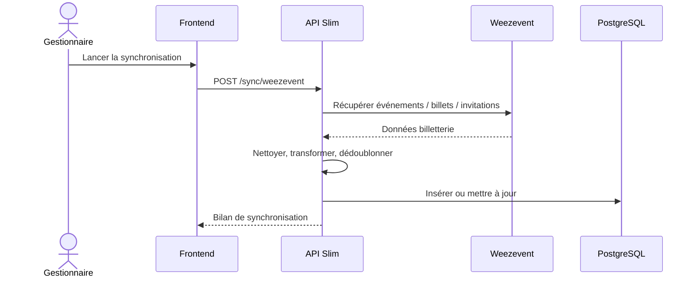
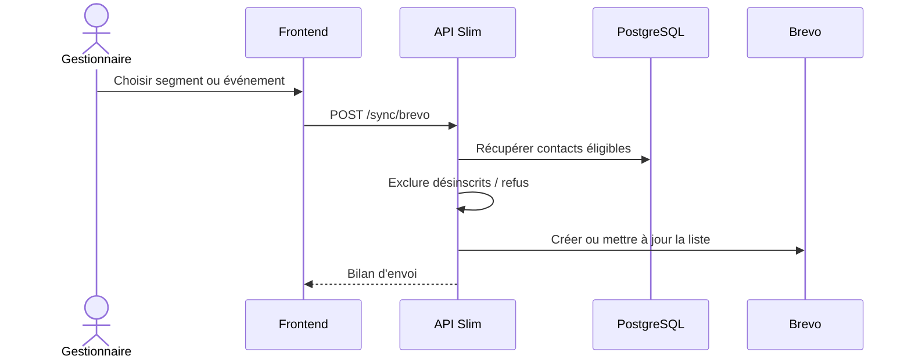
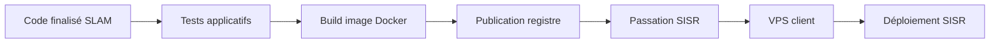

# Diagrammes Mermaid

## Vue globale des phases

```mermaid
flowchart LR
    P1[Phase 1\nMVP local dockerisé] --> P2[Phase 2\nFinalisation SLAM]
    P2 --> IMG[Image Docker\nlivrable]
    IMG --> P3[Phase 3\nDéploiement SISR]
    P3 --> PROD[Service client\nVPS + HTTPS + sauvegardes]
```

## Architecture cible

```mermaid
flowchart TD
    U[Utilisateur club] -->|HTTPS| RP[Nginx / reverse proxy]
    RP --> F[Frontend\nHTML / Tailwind / JS]
    RP --> A[API PHP Slim]
    A --> DB[(PostgreSQL)]
    A --> W[API Weezevent]
    A --> B[API Brevo]
    DB --> BK[Sauvegardes]
    A --> L[Logs applicatifs]
```

## Synchronisation Weezevent

```mermaid
sequenceDiagram
    actor Gestionnaire
    participant Front as Frontend
    participant API as API Slim
    participant W as Weezevent
    participant DB as PostgreSQL

    Gestionnaire->>Front: Lancer la synchronisation
    Front->>API: POST /sync/weezevent
    API->>W: Récupérer événements / billets / invitations
    W-->>API: Données billetterie
    API->>API: Nettoyer, transformer, dédoublonner
    API->>DB: Insérer ou mettre à jour
    API-->>Front: Bilan de synchronisation
```

## Synchronisation Brevo avec consentement

```mermaid
sequenceDiagram
    actor Gestionnaire
    participant Front as Frontend
    participant API as API Slim
    participant DB as PostgreSQL
    participant B as Brevo

    Gestionnaire->>Front: Choisir segment ou événement
    Front->>API: POST /sync/brevo
    API->>DB: Récupérer contacts éligibles
    API->>API: Exclure désinscrits / refus
    API->>B: Créer ou mettre à jour la liste
    API-->>Front: Bilan d'envoi
```

## Packaging puis déploiement

```mermaid
flowchart LR
    Code[Code finalisé SLAM] --> Tests[Tests applicatifs]
    Tests --> Build[Build image Docker]
    Build --> Registry[Publication registre]
    Registry --> Doc[Passation SISR]
    Doc --> VPS[VPS client]
    VPS --> Deploy[Déploiement SISR]
```
