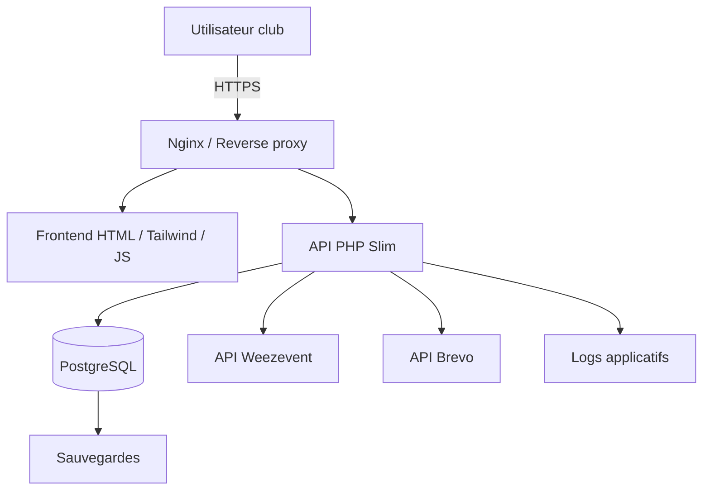
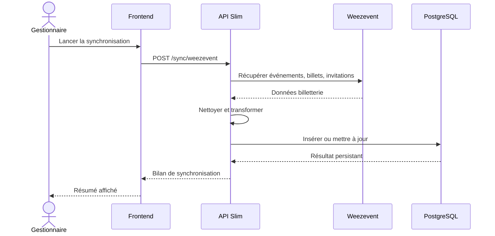
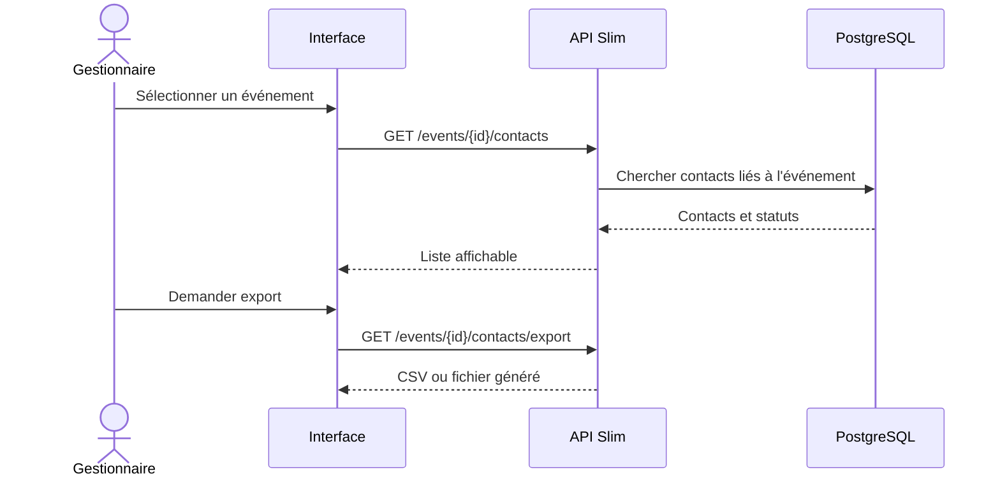
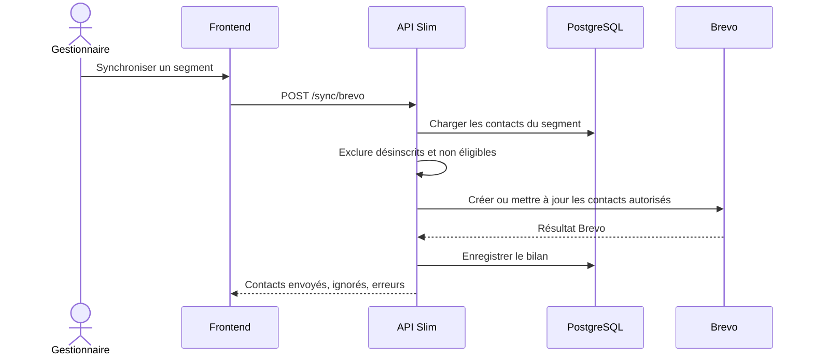
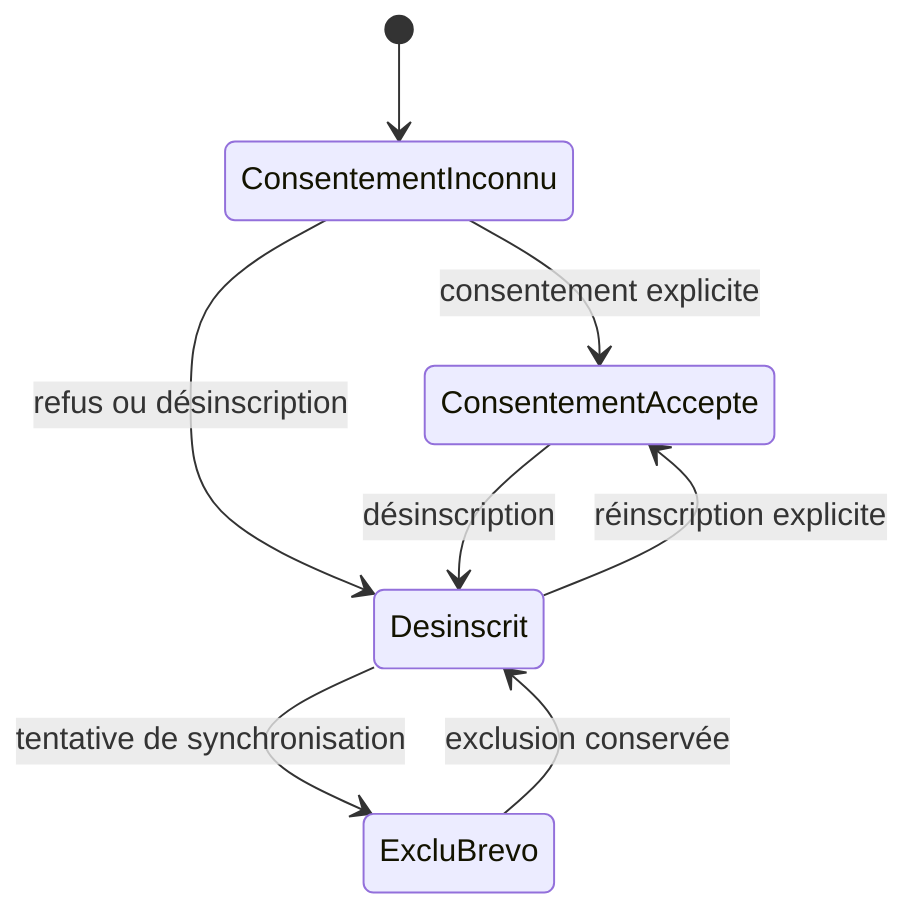
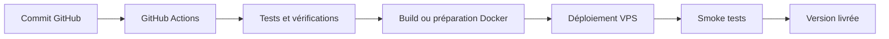
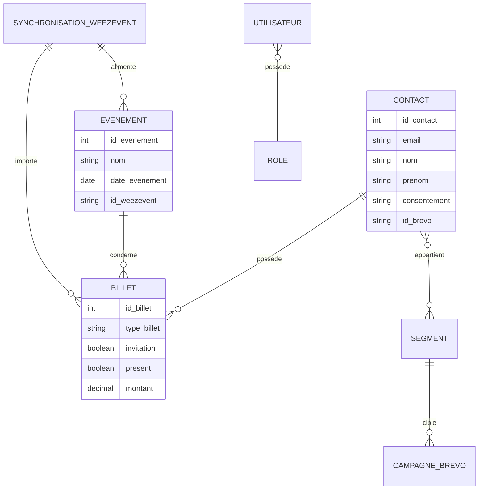

# Diagrammes Mermaid

Ces diagrammes sont volontairement simples. Ils doivent aider les étudiants SLAM et SISR à partager une même représentation du projet.

## Architecture cible

## Flux Weezevent vers dashboard

## Flux événement vers export contacts

## Flux Brevo avec contrôle du consentement

## Cycle consentement / désinscription

## Pipeline de déploiement cible

## Modèle de données simplifié

## Usage attendu

Ces diagrammes peuvent être copiés dans les supports de présentation, dans la documentation technique ou dans les fiches individuelles BTS SIO. Ils doivent rester cohérents avec l'implémentation réelle : si le modèle ou les flux changent, ce fichier doit être mis à jour.
